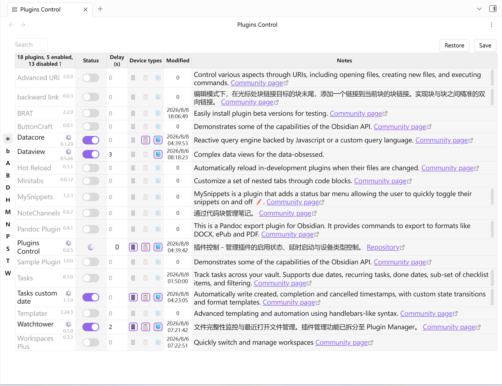

# Control Center

管理已安装 Obsidian 插件的启用状态、延时启动、设备类型规则和备注。

> [English](README.md)

## 功能

- **插件列表管理**：以表格展示所有已安装插件，支持按名称、状态、延时时间、更改时间、备注排序
- **启用/禁用切换**：一键切换插件启用状态，自动记录更改时间
- **延时启动**：为插件设置 N 秒延时；当前会话立即生效，下次启动 Obsidian 时按延时加载
- **设备类型控制**：按手机、平板、电脑三种设备类型禁用插件，切换设备后自动应用规则
- **首字母索引**：通过首字母快速定位插件
- **搜索过滤**：按插件名称或备注内容搜索
- **备注功能**：为插件添加 Markdown 备注，支持内部链接
- **配置备份/恢复**：保存并恢复全部插件的启用状态、设备规则、延时和备注
- **中英文界面**：在设置页选择中文或 English，主界面和操作提示即时切换
- **控制台日志**：默认关闭，可在设置页开启调试日志



## 设备类型控制

每个插件提供三个设备类型图标（📱 手机、📋 平板、💻 电脑），点击可切换该设备类型是否禁用此插件。

设备类型采用禁用列表（deny-list）：

- 空列表：所有设备类型均启用
- 只包含当前设备类型：当前设备禁用，其他设备启用
- 包含全部三种设备类型：插件全局禁用

## 保存与恢复（插件排查）

在茫茫多的 Obsidian 插件里面，要是哪一个插件发生了 bug，需要找到出问题的插件，或者产生冲突的插件，排查起来非常麻烦。这个功能在插件排查的时候很好用：你可以先保存当前所有插件的开关配置，然后随意地更改、关闭大量插件，等排查完之后再点击“恢复”，就可以一键恢复到之前的插件开启和关闭状态。

## 安装

### 手动安装

1. 克隆或下载本仓库到 Obsidian 的插件目录：
   ```
   <你的仓库路径>/.obsidian/plugins/plugins-control/
   ```
2. 在插件目录下运行：
   ```bash
   npm install
   npm run build
   ```
3. 在 Obsidian 中启用插件：**设置 → 第三方插件 → Control Center**
4. 打开插件设置页，在“界面语言 / Language”中选择中文或 English

## 开发

```bash
# 安装依赖
npm install

# 开发模式（监听文件变化自动编译）
npm run dev

# 生产构建
npm run build

# 发布一致性检查
npm test
```

## 发布

更新版本并同步 `manifest.json`、`versions.json`：

```bash
npm version patch
```

发布前运行 `npm test` 和 `npm run build`。

## 项目结构

```
src/
├── main.ts                  # 插件入口
├── types.ts                 # 类型定义、默认设置、旧数据迁移
├── i18n.ts                  # 中英文翻译
├── store.ts                 # Redux 状态管理
├── logger.ts                # 控制台日志（默认关闭）
├── views/
│   ├── PluginManagerLeft.tsx   # ItemView 注册
│   ├── PluginManagerView.tsx   # 主视图（插件列表表格）
│   ├── GroupView.tsx           # 搜索框
│   ├── PluginCommentCell.tsx   # 备注单元格
│   └── PMtools.ts              # 插件刷新、启停、设备规则、延时定时器
├── components/
│   └── Switch.tsx              # 开关组件
└── setting/
    └── settingTab.tsx          # 插件设置页面
scripts/
└── check-release.mjs           # 发布一致性检查
version-bump.mjs                # 版本号同步脚本
```

## 许可证

MIT
